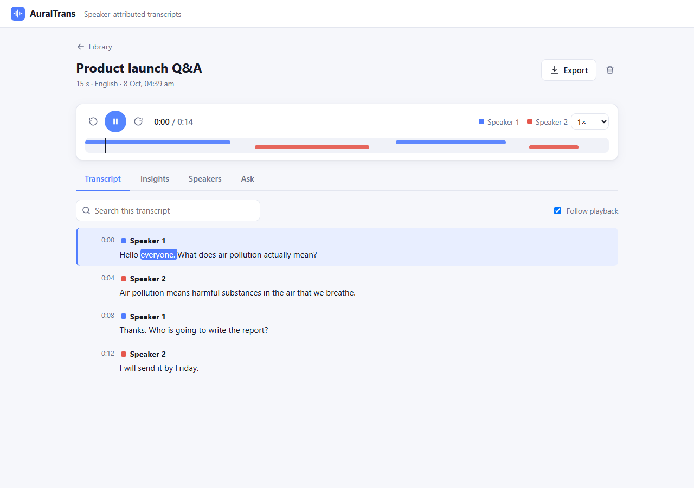
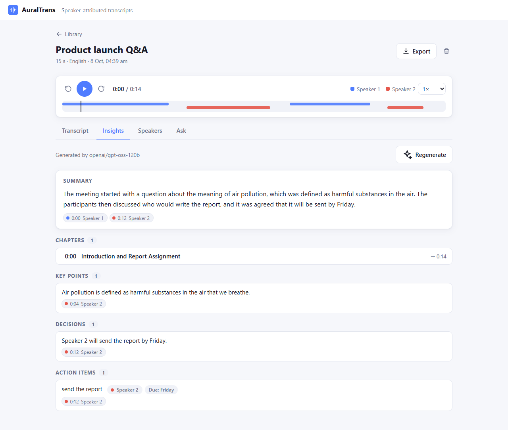
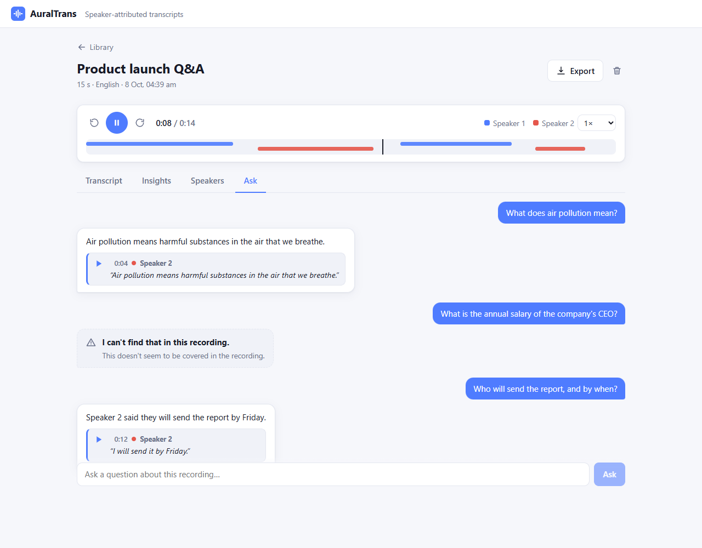
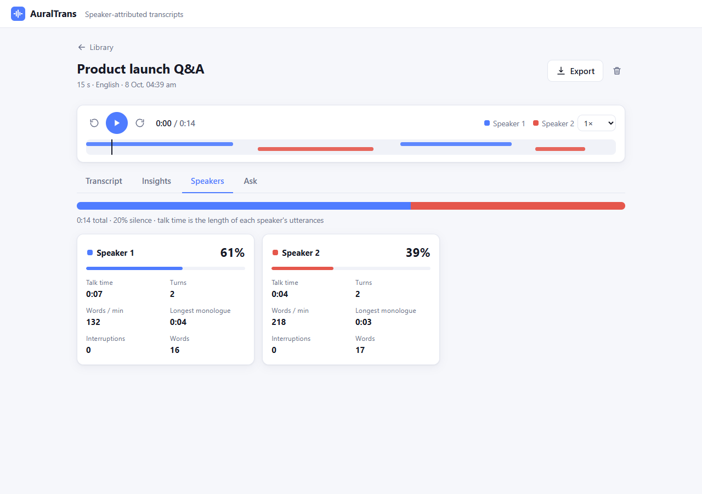
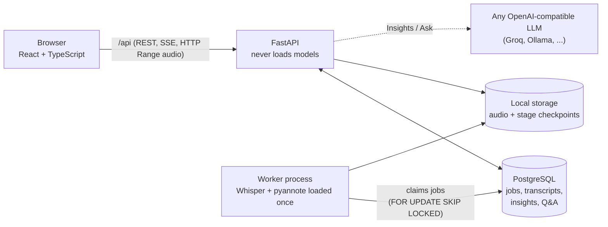
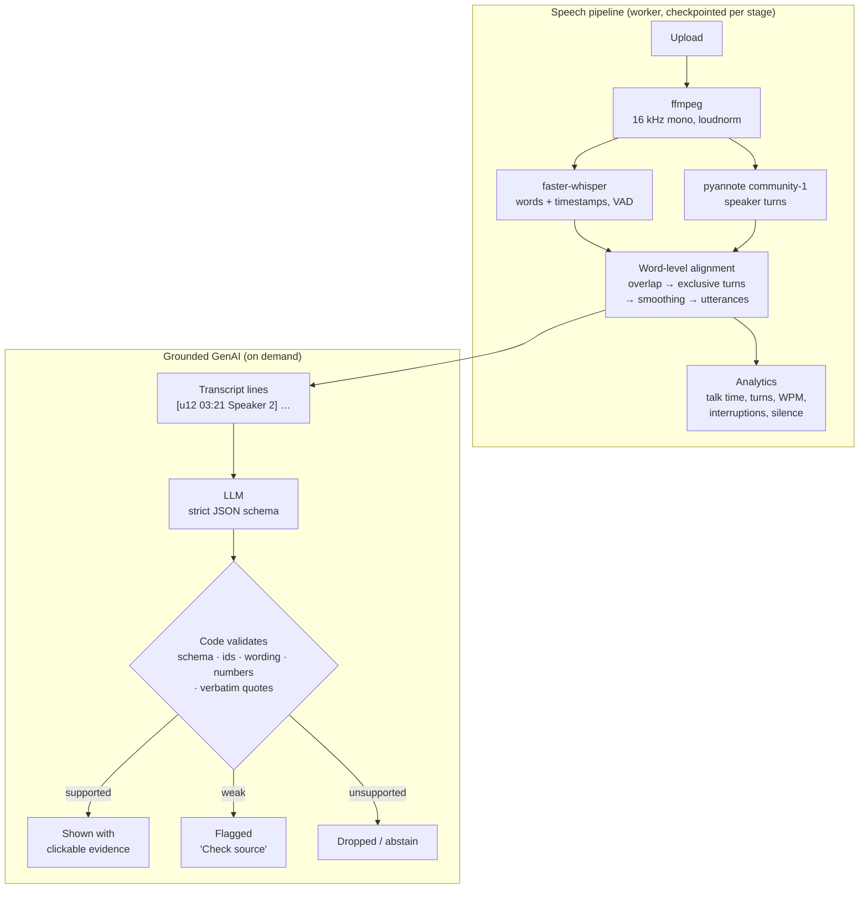

# AuralTrans 2.0

**Upload a recording and get a transcript that shows who said what, with word-level timestamps,
synchronized playback, and AI insights where every statement links back to the exact moment it came from.**

<p align="center">
  
  
</p>
<p align="center">
  
  
</p>

## The technical idea

Three things, built to work together and to be **measured** rather than assumed:

1. **Word-level speaker alignment** (`speech/align.py`). Whisper gives words with timestamps, pyannote gives
   who spoke when. Each *word* is assigned to the speaker whose turn overlaps it most, using non-overlapping
   turns, then isolated flips are smoothed and words are regrouped into utterances. Assigning per segment
   instead (the common shortcut) puts a whole sentence under one speaker even when the speaker changes
   mid-sentence. The evaluation harness scores three variants on identical ASR and diarization output
   (per segment, per word, per word + smoothing + exclusive turns) so the gain can be measured.
2. **Grounded, cited GenAI** (`insights/`, `ask/`). The language model never gets the last word. It sees the
   transcript as `[u12 03:21 Speaker 2] text` lines and must cite lines by id; **code then verifies** its JSON
   (schema, existing ids, wording and number overlap with the cited lines). Statements with no valid evidence
   are dropped, weakly supported ones are flagged "Check source", and **Ask** answers only with verbatim quotes
   that really occur in the cited utterance, otherwise it abstains ("I can't find that in this recording").
3. **A reproducible evaluation harness** (`eval/`). WER (jiwer + Whisper normalizer), DER/JER
   (pyannote.metrics), cpWER (meeteval), RTF and GPU memory on a fixed 10-meeting AMI subset, with
   guards that refuse to write a "final" report from a CPU run or without meeteval.

## What works

Library → New recording → live Processing → Workspace (**Transcript**, **Insights**, **Speakers**, **Ask**) → Export
(SRT, VTT, TXT, Markdown, JSON).

- Background processing in a separate worker, with per-stage checkpoints: a failed or crashed job resumes
  instead of starting over.
- Click any word or timestamp to seek; the active word follows the audio. Rename speakers, fix text, search.
- Insights: summary, key points, decisions, action items, open questions, chapters. Flagged stale if you
  edit the transcript afterwards.
- Ask: single-recording Q&A with timestamped quote citations and stored abstentions.

Not built, on purpose: authentication, billing, live/streaming mode, in-browser recording, DOCX export,
cross-recording search (RAG).

## Architecture



- The queue is Postgres itself (`SELECT … FOR UPDATE SKIP LOCKED`), with a heartbeat so a crashed worker's
  job is re-queued. No Redis, no Celery, no microservices.
- The API stays light: heavy models live only in the worker, so uploads and playback are never blocked by inference.
- Progress reaches the browser over Server-Sent Events; audio is served with HTTP Range requests so seeking is instant.
- Types are generated from the API's OpenAPI schema (`web/src/api/schema.d.ts`), so frontend and backend cannot drift silently.

## AI pipeline



## Results

Only numbers produced by the scripts in `eval/` appear here. **Windows CPU numbers are preliminary
pilots and are kept separate from the final GPU evaluation.**

### Final evaluation (Colab GPU, 10 AMI meetings, meeteval): pending

Not run yet: this needs a CUDA GPU, and the `--final` guards refuse to write a final report otherwise. The
Colab notebook and a commit-pinned bundle are ready (see [Reproduce the evaluation](#reproduce-the-evaluation)).
This table is filled **only** from that run.

| Metric | Final value |
|---|---|
| WER, AMI 10 meetings (small, Whisper normalizer) | pending |
| DER / JER, collar 0 and 0.25 | pending |
| cpWER, alignment ablation a / b / c (meeteval) | pending |
| RTF per stage, peak GPU memory | pending |

### Preliminary pilots (Windows CPU, `small` int8, **not for citation as final**)

Reports: [`eval/reports/preliminary/`](eval/reports/preliminary/).

| Pilot | Data | Result |
|---|---|---|
| ASR WER, LibriSpeech test-clean | 200 utterances | `tiny` 6.43%, `small` 3.16% |
| ASR WER, AMI | 2 meetings (IS1009a, ES2004a), 4,560 words | 21.10% (736 deletions, 167 substitutions, 59 insertions) |
| DER, AMI, collar 0 / 0.25 | same 2 meetings | 21.40% / 13.66% (JER on IS1009a 36.67% / 26.07%; 5 speakers detected vs 4 real) |
| ASR speed | same 2 meetings | RTF 0.29 (transcription only, CPU) |

What the pilot already tells us:

- AMI errors are dominated by **deletions** (short backchannels like "yeah"/"okay", and overlapped speech)
  on a single headset mix, not by wrong words.
- **VAD is not the cause.** On IS1009a, turning VAD off made WER *worse* (23.12% → 23.65%) and recovered
  only 20 of 330 deletions ([report](eval/reports/preliminary/vad_experiment_PRELIMINARY.md)). VAD stays on.
- Diarization over-estimates the speaker count (5 vs 4) when not told how many speakers to expect.
- The alignment-ablation cpWER pilot used a local fallback implementation rather than meeteval, so it is
  **not published here**. The ablation result will come from the Colab run.

### Engineering checks

| Check | Result |
|---|---|
| Backend tests (unit + integration against a throwaway Postgres per test) | 142 pass, 1 skipped (meeteval cross-check, Linux only) |
| Lint, strict type checking, web typecheck + build | ruff clean, mypy strict clean (54 files), `tsc` + Vite build clean |
| Browser E2E, real models and a real LLM ([`e2e/`](e2e/)) | 30 of 30 checks pass |
| Fresh database | `alembic upgrade head` → `0002`, `alembic check` reports no model drift |

The E2E run uses a 15-second synthetic conversation, so it proves the integration, not model quality.
Grounding quality (how often the model's citations pass verification on real meetings) has **not** been
measured; the checks are tested for correctness, not benchmarked.

## Run it locally (Windows, one-time setup)

You need Docker, Python 3.11, Node 20+, ffmpeg on `PATH`, and a Hugging Face account that has accepted the
terms of [`pyannote/speaker-diarization-community-1`](https://huggingface.co/pyannote/speaker-diarization-community-1)
(the speaker model is gated; a read-only token is enough).

```powershell
docker compose up -d postgres                      # 1. database

cd backend
copy ..\.env.example .env                          # 2. then put your HF_TOKEN in backend\.env
python -m pip install uv
python -m uv sync --extra speech                   # 3. installs torch, faster-whisper, pyannote (large)
python -m uv run alembic upgrade head              # 4. create / update the tables

cd ..\web
npm install                                        # 5. web dependencies
```

Then start three processes (three terminals):

```powershell
# A. API (port 8765; 8000 is often taken by other tools)
cd backend; python -m uv run uvicorn auraltrans.api.app:app --port 8765

# B. Worker: does the actual transcription. ASR_MODEL=tiny is quick for trying things out.
cd backend; $env:ASR_MODEL="tiny"; python -m uv run python -m auraltrans.worker

# C. Web app
cd web; npm run dev            # open http://localhost:5173
```

The first run downloads the Whisper and pyannote models. After that: **New recording**, pick an audio or
video file, watch it process, and the transcript opens when it is done. `make` targets exist for the same
steps (`make db api worker web test lint`).

**Speed on a CPU.** Measured on this project's Windows laptop (no GPU): transcription with Whisper `small`
runs at about 0.3x real time and speaker detection at about 1.9x real time, so a 10 minute recording takes
roughly 20 minutes. Use short clips to try it, or run the worker on a GPU machine (`ASR_DEVICE=cuda`,
`ASR_COMPUTE_TYPE=float16`).

## Language model (Insights and Ask)

Optional: without it those two tabs say so and everything else works. Any OpenAI-compatible chat endpoint
works. Set these in `backend/.env` and restart the API:

```
LLM_BASE_URL=https://api.groq.com/openai/v1      # or http://localhost:11434/v1 for Ollama
LLM_API_KEY=...                                  # not needed for Ollama
LLM_MODEL=openai/gpt-oss-120b                    # a model id your provider serves
```

**Model choice** (Groq, checked 8 Oct 2026 against the models a free key can list): `openai/gpt-oss-120b`,
with a 131k context and Groq's documented strict schema-constrained decoding for the gpt-oss models. The
app sends the JSON schema and falls back to plain JSON mode if a server rejects it. `openai/gpt-oss-20b` is
the faster, weaker alternative. The Hugging Face router needs paid credits, so it is not a free option.

**Free-tier limits.** Groq's free tier allows 8,000 tokens per minute on these models whatever their context
window. The defaults (`LLM_CHUNK_CHARS=12000`, `LLM_CONTEXT_CHARS=20000`) are sized for that: Ask works on
recordings up to roughly 25 minutes, and on a recording that size each question waits about 40 s for the rate
limit to reset. Raise both on a paid plan or with a local model.

**How answers are kept grounded**

- Output must match the JSON schema; one repair attempt with the errors fed back, then a visible failure.
- Cited ids that do not exist are removed. A statement left with no evidence is dropped.
- A statement whose wording or numbers are not found in its cited lines is shown with a "Check source" badge.
  Chapters must reference real lines and are ordered and de-overlapped.
- **Ask** needs a verbatim quote with each citation, and the quote must appear in the cited line. If the model
  declines, cites nothing valid, or the answer does not match its citations, the app says "I can't find that
  in this recording" and states why. Abstentions are stored too.
- Every model call is logged in `llm_calls`.

## Settings (`backend/.env`, see `.env.example`)

| Variable | Default | Meaning |
|---|---|---|
| `DATABASE_URL` | local Postgres from `docker-compose.yml` | where recordings and transcripts live |
| `STORAGE_PATH` | `./data` | uploaded audio and per-stage checkpoints (keep it outside OneDrive/Dropbox if you can) |
| `HF_TOKEN` | empty | Hugging Face token (read-only is enough) |
| `ASR_MODEL` | `small` | Whisper size: `tiny`, `small`, `medium`, ... |
| `ASR_DEVICE` / `ASR_COMPUTE_TYPE` | `cpu` / `int8` | use `cuda` / `float16` on a GPU |
| `MAX_UPLOAD_MB` | `500` | upload size limit |
| `LLM_BASE_URL` / `LLM_MODEL` / `LLM_API_KEY` | empty | language model for Insights and Ask (off when unset) |
| `LLM_CHUNK_CHARS` / `LLM_CONTEXT_CHARS` | `12000` / `20000` | Insights chunk size / Ask transcript size limit (free-tier sized) |
| `LLM_STRICT_SCHEMA` / `LLM_REASONING_EFFORT` | `auto` / `low` | schema-constrained decoding (`auto`, `on`, `off`); reasoning effort for gpt-oss models |
| `EVAL_DATA_DIR` | `~/auraltrans-data` | where the evaluation datasets are downloaded (outside the repo) |

## Tests

```powershell
cd backend
python -m uv run --extra speech --extra eval pytest      # needs Postgres running; DB tests skip without it
python -m uv run --extra speech --extra eval ruff check . ; python -m uv run --extra speech --extra eval mypy src
cd ..\web ; npm run build                                # typecheck + production build
cd ..\e2e ; npm install ; npm test                       # real browser, real models, real LLM: see e2e/README.md
```

Database tests use a throwaway database per test, so your data is never touched.

## Reproduce the evaluation

Details and run order: [`eval/README.md`](eval/README.md). The final, publishable run is on a Colab GPU:

1. `python eval/colab/make_bundle.py` writes `dist/auraltrans-eval-bundle-<commit>.zip`, tied to the git commit
   (it refuses a dirty tree), without any `.env`, data or reports.
2. Open `eval/colab/auraltrans_ami_eval.ipynb` in Colab with a T4 GPU, add your read-only token as the
   `HF_TOKEN` Colab secret, upload the bundle to Drive, and run all cells.
3. The notebook uses the same pipeline and configuration as the local pilot (`small`, no tuning to improve numbers),
   installs meeteval, runs the unit tests including the meeteval cross-check, fetches the same 10 meetings,
   and writes the reports plus a `run_manifest.json` (commit, hardware, package versions).
4. Copy the final reports (no `_PRELIMINARY` suffix) into `eval/reports/` and fill the table above from them.

## Repository layout

```
backend/src/auraltrans/
  speech/        Whisper, pyannote, word-to-speaker alignment, analytics  (the speech core)
  pipeline/      checkpointed stages;  worker/  Postgres-queue worker
  api/           REST + SSE + audio ranges;  llm_routes.py  Insights and Ask endpoints
  llm/ insights/ ask/   model client, generation, validation, grounded Q&A
  exporters/ storage/ db/ schemas/  exports, local storage, ORM models, shared schemas
backend/alembic/  migrations         backend/tests/  unit + integration
web/             React + TypeScript app (hand-written CSS, light and dark)
eval/            evaluation harness, Colab notebook, preliminary reports
e2e/             real-browser end-to-end test        docs/screenshots/  README images
```

## Known limits and tradeoffs

- **Final evaluation numbers are pending** (see Results). Treat every preliminary figure as a pilot.
- **CPU is slow** (about 2x real time for the full pipeline); a GPU worker fixes this with one setting.
- **Speaker count** can be over-estimated; there are min/max speaker hints at upload but no in-app speaker merging yet.
- **Citation checks are lexical** (word and number overlap, verbatim quotes), not full entailment. They catch
  invented ids, invented numbers and unrelated citations; a plausible paraphrase of the wrong line can pass.
- **Ask has no retrieval:** the whole transcript goes in the prompt, so recordings over `LLM_CONTEXT_CHARS`
  are refused with a clear message. Each question is independent (no follow-up memory).
- **Single user, no auth**, local file storage, one worker. Fine for a prototype; not a multi-tenant service.
- Hosted-LLM free tiers are rate limited (see above); transcript text is sent to whichever endpoint you configure,
  so use a local model for sensitive recordings.
- GitHub Actions CI is defined (`.github/workflows/ci.yml`) but has not been run on GitHub yet. There is no
  license file yet: choose one before publishing.
